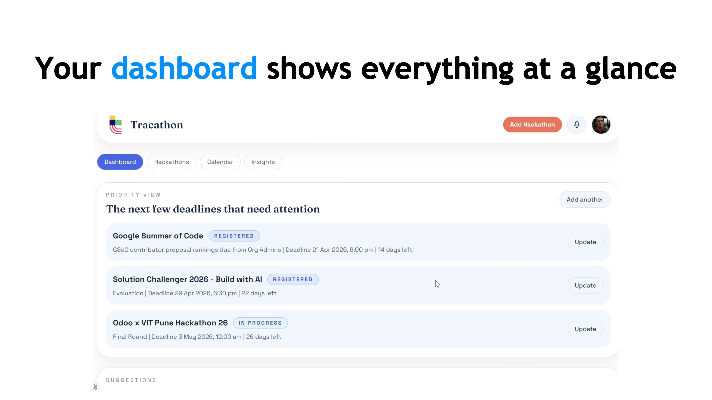
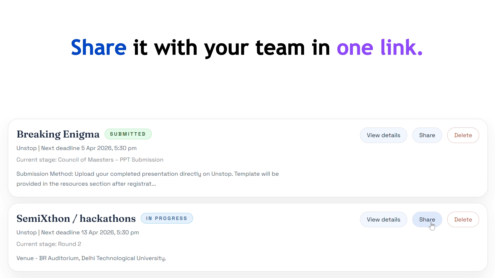
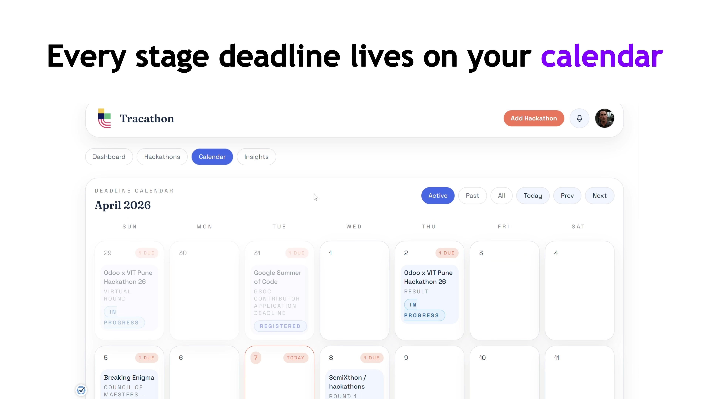
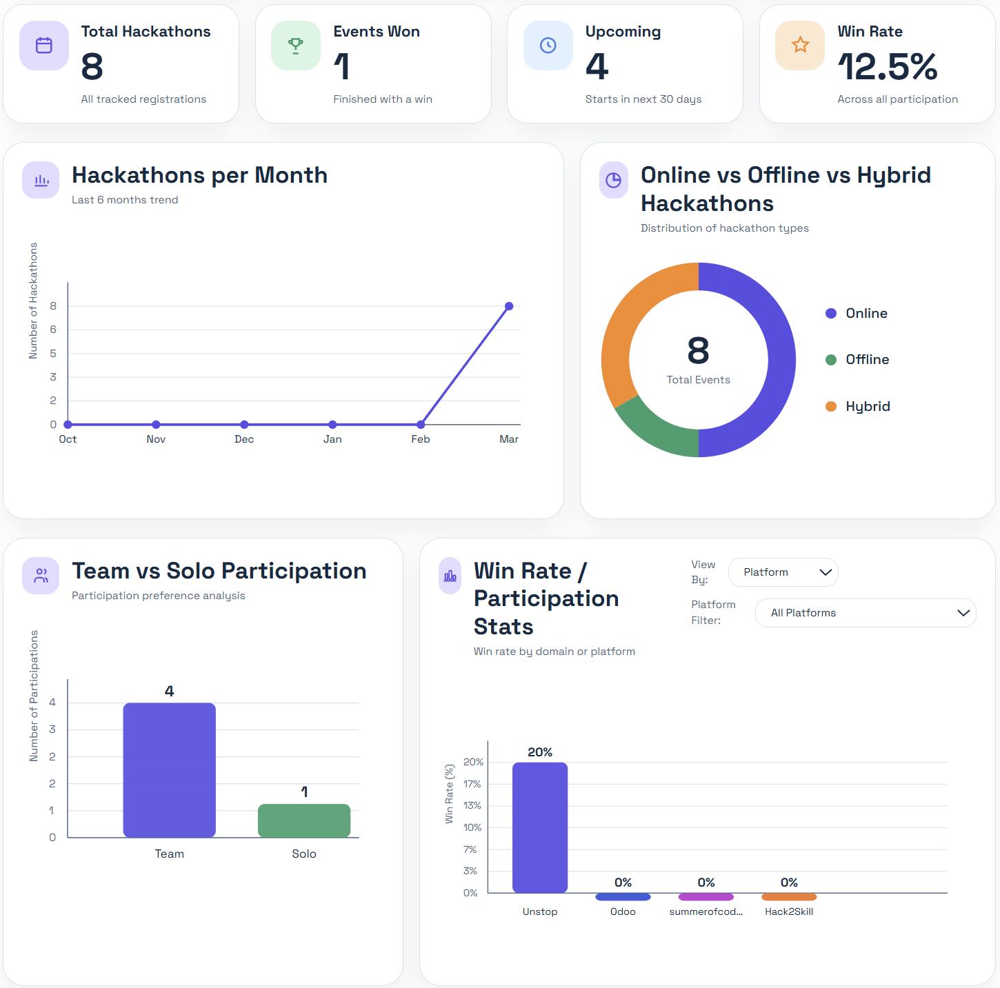

<div align="center">


# Tracathon

**The hackathon tracker built for the way student hackers actually work.**

Track every hackathon you register for — deadlines, stages, reminders, insights, and more. In one calm workspace.

[](https://tracathon.com)
[](https://reactjs.org)
[](https://mongodb.com)
[](https://vercel.com)
[](https://render.com)
</div>

---

## The problem

You register for six hackathons. You remember two. The other four? Deadlines passed. Ideas never started. Opportunities — gone.

Spreadsheets don't remind you. Notes apps don't track your stages. And your memory is already overloaded with code.

**Tracathon fixes this.**

---

## Features

### Dashboard
- **Priority view** — your closest deadlines, always front and center
- **Suggestions** — context-aware nudges based on your upcoming stages
- **Result check** — prompts you at deadlines asking whether a stage was worked on, keeping you accountable
- **Monthly stats** — see how active you've been across the month
- **Live countdowns** — every hackathon ticking in real time

### Hackathons
- View hackathons across **Active**, **Past**, and **All** tabs
- Subcategories: **Won**, **Lost**, **Missed**, **In Progress**, **Submitted**
- Per-hackathon detail page with full stage timeline

### Calendar
- Stage deadlines plotted on a calendar by date
- Filter by Active, Past, or All hackathons
- At-a-glance view of your entire competition schedule

### Insights
- Stats: total hackathons, events won, upcoming, win rate
- Graphs: monthly participation, online vs offline vs hybrid distribution, team vs solo, win rate by domain and platform
- Filter by **3 months**, **6 months**, or **12 months**
- Export your full insights report as **JSON**

### Smart notifications
- Set reminders **per hackathon individually**
- Three modes: **In-app only**, **Email only**, or **In-app + Email**
- Deadline reminders fire automatically based on your preference

### Adding hackathons — four ways
| Method | How it works |
|--------|-------------|
| **Manual entry** | Fill in details yourself |
| **Paste website text** | Copy-paste text from a hackathon page — Tracathon extracts name, stages, deadlines, rewards, and platform automatically |
| **Paste website URL** | Drop the URL — Tracathon fetches and parses the page |
| **Tracathon share link** | A teammate shares a link — you paste it and all details import instantly |

### Sharing
- Share any hackathon with teammates via a **generated link**
- Recipients paste the link into their Tracathon to import the full hackathon — no re-entry needed

### Account
- Profile photo upload
- Change email (with verification flow)
- Change password
- Dashboard sort order preference
- Dark / Light mode toggle
- Account deletion

---

## Tech stack

| Layer | Technology |
|-------|-----------|
| Frontend | React + Vite |
| Backend | Node.js + Express |
| Database | MongoDB Atlas |
| Auth | Google OAuth 2.0 + Email/Password |
| Email | Resend |
| Deployment | Vercel |

---

## Screenshots

> Dashboard · Priority View



> Hackathons · Active View



> Calendar · Stage Deadlines



> Insights · Graphs & Stats



---

## Project structure

```
tracathon/
├── client/                  # React + Vite frontend
│   ├── src/
│   │   ├── pages/           # Dashboard, Hackathons, Calendar, Insights, Account
│   │   ├── components/      # Shared UI components
│   │   ├── hooks/           # Custom React hooks
│   │   └── utils/           # Helpers and formatters
│   └── public/
│       └── site-media/      # Logos and static assets
│
└── server/                  # Node.js + Express backend
    ├── controllers/         # Auth, Hackathons, Notifications, Insights
    ├── models/              # Mongoose schemas (User, Hackathon, Notification)
    ├── routes/              # API route definitions
    ├── middleware/           # Auth guard, error handler
    └── utils/               # Email templates, token helpers, metadata parsers
```

---

## Core pages

### `/dashboard`
Priority view of upcoming deadlines, suggestions, stats, result check prompts, and monthly activity summary.

### `/hackathons`
Full list of your registered hackathons with filters, subcategories, and per-hackathon detail views with stage timelines.

### `/calendar`
Stage-wise deadline calendar with active/past/all filters.

### `/insights`
Participation analytics with graphs, win rate breakdown by domain and platform, and JSON export.

### `/account`
Profile settings, notification preferences, appearance, and security.

---

## Auth flows

- **Email/Password** — signup with email verification, forgot password, reset password, change email (dual verification — old and new address)
- **Google OAuth** — one-click sign-in via Google
- **Session security** — suspicious sign-in detection based on IP and device fingerprint, with automatic security alert emails

---

## Email notifications

Tracathon sends contextual transactional emails for:

| Trigger | Email |
|---------|-------|
| New signup | Welcome + onboarding steps |
| Email registration | Email verification link |
| Forgot password | Password reset link (1 hr expiry) |
| Password changed | Confirmation alert |
| Email change | Verification to new address + alert to old address |
| Suspicious sign-in | Security alert with device and IP info |
| Stage deadline | Reminder (based on per-hackathon preference) |

---

## Roadmap

- [ ] Mobile app (iOS + Android)
- [ ] Hackathon discovery feed
- [ ] Team collaboration mode
- [ ] Public profile / portfolio page
- [ ] Browser extension for one-click hackathon import

---

## Note on source code

This is a **public showcase repository**. The full source code is not open source. This repository exists to document the project, its architecture, and its features.

If you'd like to try the product, it's **free and live** at [tracathon.in](https://tracathon.in).

---

## Built by

**the-sourcerer-supreme** — designed, built, and shipped solo.

[](https://youtube.com/@tracathon)

---

<div align="center">

**Stop forgetting the hackathons you care about.**  
**Start showing up to every one that matters.**

[**Try Tracathon — Free**](https://tracathon.in)

</div>
